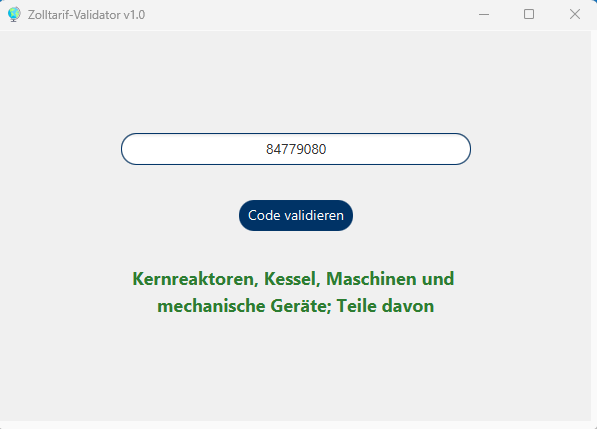

# 🌍 Zolltarif-Validator v1.0

Ein modernes JavaFX-Tool zur schnellen Validierung und Kategorisierung von Zolltarifnummern (HS-Codes).

## ✨ Features
* **Echtzeit-Validierung**: Prüft, ob die Eingabe genau 8 Ziffern umfasst.
* **Kapitel-Erkennung**: Identifiziert automatisch die Warengruppe basierend auf den ersten zwei Ziffern (z.B. Maschinen, Elektrotechnik).
* **Modernes UI**: Klares, barrierefreies Design mit dynamischem Feedback (Grün/Rot) und "Wrap Text"-Unterstützung für lange Beschreibungen.
* **Benutzerfreundlich**: Automatischer Fokus auf die Ergebnisseite für bessere Sichtbarkeit.

## 🛠 Technologien
* **Java 21**
* **JavaFX 21/25**
* **FXML & CSS** (für das Styling)

## 🚀 Installation & Start
1. Klone das Repository oder lade die `.jar` Datei herunter.
2. Stelle sicher, dass Java 21+ installiert ist.
3. Starte die Anwendung über die Konsole oder per Doppelklick:

[⬇️ Lade die ZolltarifValidator.jar hier herunter](ZolltarifValidator.jar)

---

## 🛠 Geplante Verbesserungen (Roadmap)
Um das Tool noch praxistauglicher zu machen, sind folgende Erweiterungen geplant:

- [X] **Grafische Oberfläche:** Umstieg von der Konsole auf eine benutzerfreundliche JavaFX-Oberfläche.(✅ Erledigt in v1.0)
- [ ] **Externe Datenquelle:** Einlesen der Warenkapitel aus einer CSV-Datei oder Datenbank statt einer internen HashMap.
- [ ] **Erweiterte Validierung:** Prüfung auf 11-stellige Codenummern für den Import-Bereich.
- [ ] **API-Anbindung:** Testweise Anbindung an eine Zoll-Datenbank zur Live-Abfrage von Zollsätzen.
